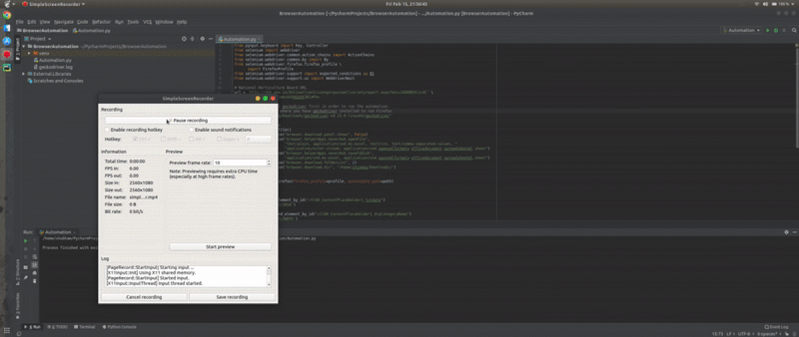

# Automating-Web-Browser-Interaction-using-Selenium

This is an implementation of Selenium, a python library for simple Web Automation.

I have tried to download an excel file from the National Horticulture Board Website - [nhb.gov.in](http://nhb.gov.in/OnlineClient/categorywiseallvarietyreport.aspx?enc=3ZOO8K5CzcdC/Yq6HcdIxJ4o5jmAcGG5QGUXX3BlAP4=)

Everything is set up and in order to execute the program just browse to the path where the cloned repository is located in your terminal and type `python Automation.py`or import it on Pycharm or any IDE and run it.

But, first you would need to install drivers for the corresponding Browsers and specify the location in the python module.

## Browsers
* FireFox
* Chrome

## Installations
* Geckodriver - [Firefox driver](https://github.com/mozilla/geckodriver/releases)
* Chromedriver - [Chrome driver](https://github.com/SeleniumHQ/selenium/wiki/ChromeDriver)

## Demo

